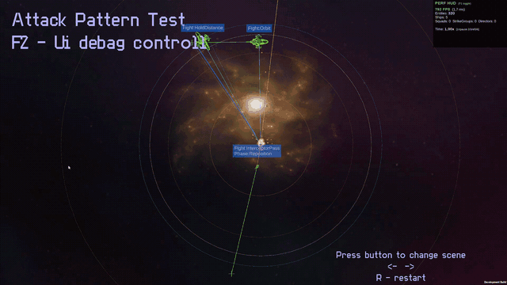

# Edge Fleet (Space Must Burn)

[English](README.md) | Русский

Прототип 2D космической RTS на Unity DOTS/ECS, сделан как портфолио-проект. Стресс-тест: 5 000 кораблей в одном бою при 60+ FPS в standalone-билде (Ryzen 7 7800X3D + RTX 4070 Ti).

**Поиграть в билд:** https://yargf.itch.io/space-must-burn

**Видео:** https://youtu.be/E9CE5SzluJs

Что сделано мной:

- Игровая архитектура и ECS-системы вокруг неё
- Движение по flow field, боиды, отряды и ударные группы
- Двухуровневый выбор целей и data-driven оружие
- Пул снарядов и попадания по отрезку траектории
- Пайплайн команд от клика игрока до состояния корабля
- Инструменты производительности: покадровые бюджеты, распределение нагрузки, компоненты, дружелюбные к change-фильтрам

Это мой личный портфолио-проект; всё в `Assets/MyAssets` сделано мной.

## Оглавление

- [Как запустить](#как-запустить)
- [Управление](#управление)
- [Производительность](#производительность)
- [С чего читать код](#с-чего-читать-код)
- [Как это работает](#как-это-работает)
- [Папки](#папки)
- [Лицензия](#лицензия)

## Как запустить

Проще всего — билд на itch.io: https://yargf.itch.io/space-must-burn

Из исходников:

1. Склонируйте репозиторий.
2. Откройте проект в Unity `6000.3.6f1` (Unity Hub → Add → выбрать папку клона). Первый импорт занимает несколько минут: Unity подтягивает пакеты и компилирует Burst.
3. В окне Project перейдите в `Assets/MyAssets/Scenes` и откройте `AiTest.unity`.
4. Нажмите Play и используйте демо-кнопки, чтобы заспавнить пресеты армий и бои.

Никакой дополнительной настройки не требуется.

## Управление

- ЛКМ - выделение / рамка
- ПКМ - движение, атака или следование, зависит от того, по чему кликнули
- Shift - очередь приказов
- A + клик - attack-move
- Цифры + Ctrl - ударные группы
- Стоп / режим огня / режим движения - кнопки на командной панели

## Производительность

Весь проект построен вокруг одной цели: тысячи кораблей в бою одновременно без просадок кадра.

- Стресс-тест: 5 000 кораблей в одной сцене при 60+ FPS. Замер в standalone-билде на Ryzen 7 7800X3D + RTX 4070 Ti; тест считается пройденным, только если FPS не падает ниже 60.
- За счёт чего: flow field вместо A* на юнита, spatial hash для всех поисков соседей, покадровые бюджеты с джиттером повторов для всей тяжёлой работы, пул снарядов вместо Instantiate/Destroy и запись компонентов только при реальных изменениях, чтобы работали change-фильтры ECS. Подробности в [заметках по дизайну](#заметки-по-дизайну).

## С чего читать код

Код лежит в `Assets/MyAssets/_Script`. Точки входа в порядке чтения:

1. [`CommandInputHandler.cs`](Assets/MyAssets/_Script/Runtime/Input/Commands/CommandInputHandler.cs) + [`CommandDequeueSystem.cs`](Assets/MyAssets/_Script/ECS/Commands/Systems/CommandDequeueSystem.cs) - пайплайн команд от клика до состояния корабля.
2. [`FlowFieldSystem.cs`](Assets/MyAssets/_Script/ECS/Movement/Systems/FlowField/FlowFieldSystem.cs) - BFS flow field с покадровым бюджетом, слоями размеров и кэшем.
3. [`ShipToGridSystem.cs`](Assets/MyAssets/_Script/ECS/Vision/Systems/Grid/ShipToGridSystem.cs) - spatial hash, через него идёт каждый поиск соседей в игре.
4. [`EmbeddedFindTargetSystem.cs`](Assets/MyAssets/_Script/ECS/Combat/Targeting/Systems/Selection/EmbeddedFindTargetSystem.cs) - поиск целей с покадровым бюджетом, турели распределяют урон между целями.
5. [`FightSystem.cs`](Assets/MyAssets/_Script/ECS/Combat/Systems/Patterns/FightSystem.cs) - паттерны боевого движения (орбита, заход на цель, стрейф, рой...).
6. [`ProjectilePoolUtility.cs`](Assets/MyAssets/_Script/ECS/Combat/Projectiles/Pooling/Common/Utilities/ProjectilePoolUtility.cs) - пул снарядов с ростом по требованию и жёстким лимитом.
7. [`SquadCommandApplyUtility.cs`](Assets/MyAssets/_Script/ECS/Squads/Systems/SquadCommandApplyUtility.cs) - как команды отряда превращаются в состояние кораблей.

`RtsInputActions.cs` - сгенерированный код Unity Input System.

## Как это работает

Input превращает клики в команды. Команды лежат в очередях `DynamicBuffer` на кораблях и отрядах. Вся игровая логика - в ECS-системах. UI читает состояние и отправляет команды обратно. Input и UI никогда не трогают игровую логику напрямую.

### Пайплайн команд

Правый клик проходит так: `CommandInputHandler` рейкастом определяет, по чему кликнули (враг = AttackTarget, свой = FollowEntity, пусто = MoveToPoint), собирает выделенные отряды по кораблям с `Selected` и записывает команду. Если выделена целая ударная группа - команда идёт как групповой приказ, иначе по отрядам. Корабли без отряда получают её в собственную очередь. С Shift команда добавляется в очередь, без Shift очередь очищается и команда выполняется сразу.

Команды лежат в буфере, пока корабль не готов. `CommandDequeueSystem` проверяет каждый кадр: корабль Idle, охраняет точку или прибыл - тогда берёт следующую команду, ставит состояние корабля и запрашивает flow field для группы. Команды отрядов идут через `SquadCommandApplyUtility`, которая превращает их в то же по-корабельное состояние.

### Flow field

A* потребовал бы путь на каждого юнита - слишком дорого для сотен кораблей. Flow field - одна карта направлений на цель, ей может пользоваться любое число кораблей. Корабль просто смотрит на клетку, в которой стоит, и получает направление. Одна группа кораблей с общей целью = одно поле.

Поле строится в два прохода. Сначала волна BFS от цели: клетка цели стоит 0, соседи 1, их соседи 2 и так далее, стены пропускаются, дорогие клетки стоят больше. Второй проход даёт каждой клетке направление к самому дешёвому соседу. Диагонали разрешены только когда обе боковые клетки свободны, чтобы корабли не срезали углы сквозь стены.

Детали:

- Три слоя проходимости (small/medium/large). Большой корабль не пролезет там, где пройдёт истребитель, поэтому на слое Large узкие проходы считаются стенами. Группа строит поле на своём слое.
- Бюджет: максимум 2 перестройки BFS за кадр. Если приказать двигаться 30 группам, поля построятся за несколько кадров.
- Кэш: если клетка цели, слой и версия препятствий не изменились, поле не перестраивается вовсе.
- Цель внутри стены: `TryFindNearestWalkableCell` ищет вокруг кольцами.

### Скорость корабля

Итоговая скорость - сумма отдельных частей, каждую пишет своя система: `PathVelocity` от flow field, `CombatVelocity` от FightSystem, `AvoidanceVelocity` от препятствий, плюс separation/alignment/cohesion боидов от соседей. `SetTotalVelocitySystem` всё суммирует и ограничивает maxSpeed и ускорением (с множителями EMP и баффов), `MoveVelocitySystem` применяет к позиции.

Боиды работают параллельным джобом (`IJobEntity`). Мелкие корабли обновляются через кадр, крупные каждый кадр, но только separation. Avoidance: жёсткая проверка (корабль уже в плохой клетке) идёт каждый кадр, мягкий превентивный сэмплинг - в стаггер-корзинах.

### Spatial hash

`ShipToGridSystem` каждый кадр перестраивает `NativeParallelMultiHashMap<int2, Grid>`: мир нарезан на клетки (6 юнитов, плюс сетка 30 юнитов для больших кораблей), каждая клетка хранит корабли внутри неё. «Кто рядом со мной» тогда значит проверить несколько соседних клеток вместо всех кораблей на карте. Через эти карты идёт каждый поиск соседей в игре: боиды, таргетинг, попадания пуль, агро.

### Таргетинг

Целей два уровня. `ShipAgroSystem` выбирает цель корабля (с кем дерусь, куда лечу в бою). `EmbeddedFindTargetSystem` выбирает цель для каждого слота турели отдельно. Поэтому корабль может лететь на линкор, пока его турели стреляют по истребителям, которые ближе.

Поиск турелей написан так, чтобы не спайкать кадр:

- `findTargetTimer` - абсолютная метка времени. Таймер не истёк = дешёвый путь, только проверка что текущая цель жива. Истёк = тяжёлый путь со сканом сетки.
- Жёсткий бюджет: максимум сканов сетки за кадр. Бюджет кончился = держим старую цель, повтор чуть позже. Задержки повторов джиттерятся по слотам, чтобы тысячи турелей не проснулись в один кадр.
- Pressure: карта «цель → сколько dps на неё уже назначено». Кандидат, по которому уже стреляет полфлота, получает штраф. Без этого каждая турель выбирает одну и ту же ближайшую цель и большая часть урона уходит в overkill.

### Боевые паттерны

`FightSystem` работает для кораблей в бою и пишет одну вещь: точку, куда корабль должен лететь (`fightTarget`). Скорость и повороты - забота движения. У каждого корабля паттерн из префаба: HoldDistance, CloseAndHold, Orbit, AttackRun, InterceptorPass, MissileAttackRun, Strafe, Dogfight, Swarm.

Паттерны с фазами работают как маленький конечный автомат. AttackRun например: сближение, огневой проход сквозь цель, отрыв, перестроение - и снова. Каждый корабль сидит свой rng от id сущности, поэтому двадцать истребителей не выполняют одинаковые манёвры синхронно. Идеальная дистанция всегда ограничивается реальной дальностью оружия, иначе паттерн может держать корабль там, где он никогда не выстрелит.

### Оружие и снаряды

Статы оружия живут в ScriptableObject. На загрузке `WeaponProfileDatabaseBuildSystem` запекает их в BlobAsset-базу: одна неизменяемая копия в памяти, читается из Burst-джобов, ссылки по индексу. Поток выстрела - три шага: `EmbeddedWeaponFireRequestBuildSystem` кладёт запрос в очередь, когда слот готов, `BallisticFireRequestExecutionSystem` берёт пулю из пула и запускает, `BulletMoverSystem` двигает её и проверяет попадания.

Быстрые пули могут перепрыгнуть корабль между двумя кадрами, поэтому проверка попадания - отрезок от старой позиции к новой против AABB кораблей, кандидаты берутся из клеток spatial hash вдоль пути. Побеждает ближайшее попадание на отрезке.

### Пул снарядов

Пули никогда не создаются и не уничтожаются во время боя. Пул преспавнит их, выключенными и припаркованными за картой. Acquire достаёт из free list, валидирует что сущность ещё в порядке, и может растить пул до жёсткого лимита. Пул полон = выстрел отбрасывается и считается. У Release защита от двойного возврата, иначе одна пуля могла бы попасть в free list дважды и достаться двум стрелкам. Пул считает отбросы, двойные возвраты и пиковое использование - после боя эти счётчики говорят, правильно ли подобран размер пула.

### Отряды и ударные группы

Три уровня: ударная группа (хоткей-группа игрока, Ctrl+1..9), отряд (летит строем, имеет очередь команд), корабль (слот 0 - лидер). Групповые приказы разворачиваются в команды отрядов, команды отрядов - в состояние кораблей.

Строи: каждый корабль знает свой слот среди живых членов, `FormationUtility` даёт смещение от лидера (клин, линия, кольцо, колонна), смещение поворачивается с курсом отряда. Весь отряд летит по одному flow field к якорю отряда, строй - только финальная поправка. Смещения кэшируются и перестраиваются только при смене строя, интервала или числа членов.

Эскадрильи авианосца - те же отряды с `origin = Carrier`. Игрок не может командовать ими напрямую, ими управляет логика авианосца и слоты ангара.

### UI

UI получает состояние через снапшоты. `UiSelectionQueryUtility` один раз обходит выделение и собирает одну структуру (счётчики, режимы огня/движения, флаги «смешано»), каждая панель рендерится из неё. Кнопки зовут методы `CommandInputHandler`, поэтому клик по UI проходит тот же пайплайн, что и клик по карте.

### Заметки по дизайну

- Таймеры хранят абсолютную метку времени, а не обратный отсчёт. Отсчёт пишет компонент каждый кадр, что помечает чанк изменённым и ломает change-фильтрацию всем системам после. По той же причине все хелперы `Write...IfChanged`: не писать, если значение не изменилось.
- У любой тяжёлой работы есть покадровый бюджет или стаггер по хэшу сущности: постройка flow field, сканы турелей, боиды, avoidance, наведение турелей. Пара кадров задержки незаметна.
- Пулинг вместо Instantiate/Destroy: структурные изменения создают sync point'ы и перемещают сущности между чанками. Тысячи пуль в секунду означали бы постоянные sync point'ы. Включение/выключение `BulletActive` - не структурное изменение.
- Flow field вместо A*: юнитов много, уникальных целей мало, поэтому одно поле на группу сильно дешевле пути на корабль.

## Папки

- `_Script/ECS/Core` - общие компоненты, енамы, константы, математика сетки
- `_Script/ECS/Commands` - очередь команд корабля
- `_Script/ECS/Squads` - отряды, строи, очередь команд отряда
- `_Script/ECS/Strategy` - ударные группы (хоткей-группы), приказы, стойки
- `_Script/ECS/Movement` - flow field, боиды, avoidance, скорость
- `_Script/ECS/Combat` - таргетинг, оружие, снаряды, пулинг, здоровье
- `_Script/ECS/Vision` - туман войны, прожекторы, spatial hash
- `_Script/ECS/Carrier` - эскадрильи авианосца, ангар, отзыв
- `_Script/ECS/Resources` - астероиды, харвестеры, энергия
- `_Script/ECS/Mission` - скриптинг миссий и триггеры
- `_Script/Runtime` - input, выделение, камера (сторона MonoBehaviour)
- `_Script/UI` - UI читает состояние ECS и шлёт команды, игровой логики в UI нет
- `_Script/Debug`, `_Script/Demo` - дебаг-отрисовка, демо-сцены AI, пресеты армий

## Лицензия

Код в `Assets/MyAssets` - под [лицензией MIT](LICENSE). В `Assets/NotMy` лежат сторонние пакеты и ассеты со своими лицензиями.
